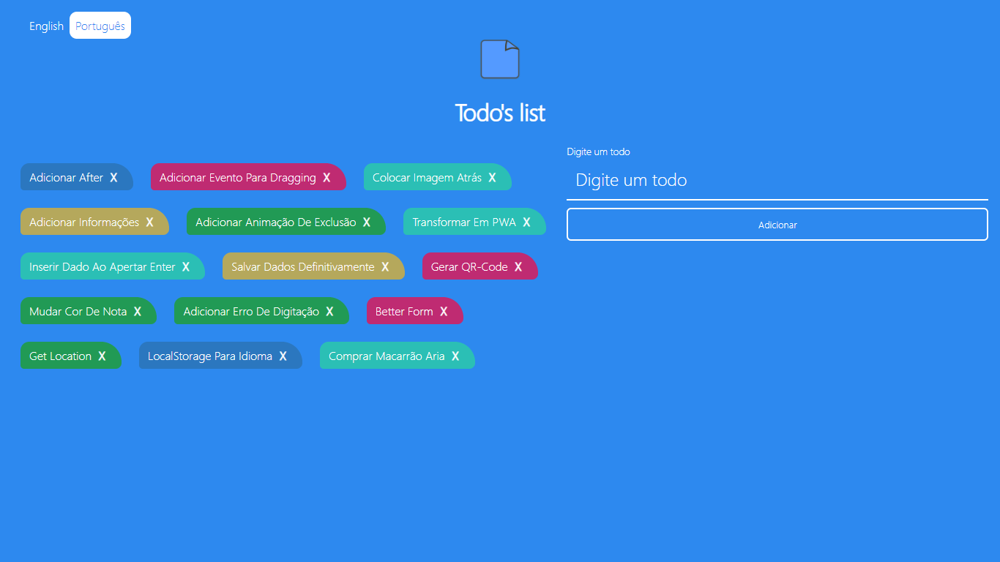
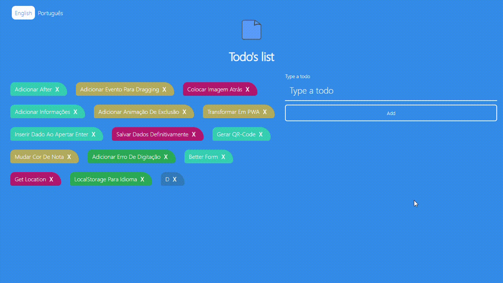

# TODO APP

Created for [Bruno Augusto](http://brunoaugustosilva8.github.io)
App represents the todo list
Simple note application



## Languages

> English, Portuguese. If you want to add any language look this example.

Use the langcode [Lang Codes](http://www.lingoes.net/en/translator/langcode.htm)

```json
"pt-BR": {
    labelCorrect: "Digite um todo",
    labelIncorrect: "Valor repetido",
    buttonTxt: "Adicionar",
    inputTitle: "Insira um bilhete aqui",
    messageTexts: [
        "Sem valor",
        "Valor repetido",
        "Valor adicionado com sucesso",
        "Valor removido com sucesso",
        "Valores removidos com sucesso"
    ],
}
```

Add the checkbox input

```html
<div class="languages">
  +++
  <input id="[lang codes]" type="radio" name="languages" value="[lang codes]" />
  <label for="[lang codes]">Your language name</label>
  +++
</div>
```

Don't forget to pull it!

## How to install

Fork this repository.

> Make a directory

```bash
mkdir [directory]
```

> Clone this repository

```bash
git clone https://github.com/brunoaugustosilva/todosapp.git
```

> Starts NPM

```bash
npm install
```

> Tests

Run this project with:

```bash
npm start
```

## How to use

Type a note



Click in "Add"

The note was added

## App tips

> Alert messages

```js
alertMessage("Title", "Color");
//example alertMessage("Empty value", "red");
```

> Note colors

There is a class in Javascript has represent the color of notes. Add the class in css and javascript.

```js
const CLASSES = ["purple", "yellow", "green", "lightBlue", ""];
```

CSS (Don't forget the !important)

```css
.purple {
  background-color: #bf2b72 !important;
}
```

## License

This repository is licensed about MIT license - See [MIT LICENSE](LICENSE.md)
